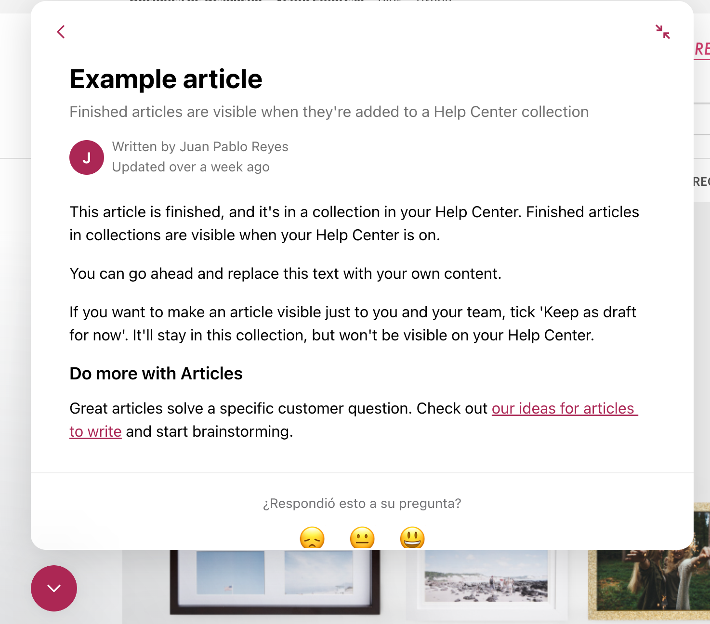

# Tarea 2: Heurísticas de Nielsen

| Integrantes |   |   |   |   |
|---|---|---|---|---|
| Estudiante 1: | Camila Mena |   |   |   |
| Estudiante 2: | Joaquín Aguilera  |   |   |   |
| Estudiante 3: | Nicole Rojel  |   |   |   |

## Heuristícas de Nielsen aplicadas a las aplicaciones 

Describa brevemente un ejemplo de cumplimiento y uno de incumplimiento de las distintas heurísticas de Nielsen si existen dichos ejemplos de la aplicación Web de [Emotions.cl](https://emotions.cl/). Si no existen ejemplos de cumplimiento o incumplimiento indicarlo y argumentar el por qué no existe dicho ejemplo. La solución a la tarea se debe entregar en un documento Markdnown subido al repositorio Git del grupo en el [Gitlab de Informática](https://gitlab.inf.utfsm.cl/). Es posible utilizar pantallazos en el documento Markdown ya que el contenido se renderiza automáticamente en HTML de forma correcta.

1. Consistencia y estándares 
    * Ejemplos positivos
        1. Al pasar el mouse por los botones te da a entender que puedes clickearlo 
    * Ejemplos negativos
        1. Al ingresar a la sección de Mundo Mascotas aparece una imagen en grande con un enlace "Ver más aquí" y al apretarlo te redirigue a la misma página donde ya estabas 
        2. Hay colores que no aparecen en el filtro de busqueda 

2. Visibilidad del estado del sistema
    * Ejemplos positivos
        1. Al ingresar a favoritos, si no tienes nada te lo menciona con un cuadro amarillo 
    * Ejemplos negativos
        1. Una vez ya iniciada la sesión sigue apareciendo la opción de registrarse 
        2. Cuando no cargan imagenes, salen "rotas" 

3. Similitud entre el sistema y el mundo real
    * Ejemplos positivos
        1. Los nombres puestos en  menú son entendibles por todos 
    * Ejemplos negativos
        1. 

4. Control de usuario y libertad
    * Ejemplos positivos
        1. Al poner filtros hay una forma muy fácil para borrar ese filtro si se puso por error 
    * Ejemplos negativos
        1. Mal control de libertad de usuario, ya que al crear una cuenta te ponen por defecto el check en recibir ofertas y promociones 
        2. Al pedir ayuda por el icono inferior derecho (ya que hay dos opciones para pedir ayuda) te dirigue a un error 

5. Reconocimiento más que recuerdo
    * Ejemplos positivos
        1. Buena consistencia del uso de iconos 
    * Ejemplos negativos
        1. Hay dos secciones en la página principal de recomendaciones y se consideran lo mismo, puede que para los creadores sea distinto
         

6. Prevención del error
    * Ejemplos positivos
        1. Al apretar ciertos filtros desaparecen las otras opciones que habían para evitar errores de busqueda 
    * Ejemplos negativos
        1. 

7. Ayuda al usuario en reconocer, diagnosticar y recuperarse del error
    * Ejemplos positivos
    * Ejemplos negativos

8. Flexibilidad y eficiencia de uso
    * Ejemplos positivos
    * Ejemplos negativos
        1. Al querer comprar te obligan a crearte una cuenta y no dan opción de comprar como invitado 

9. Diseño estético y minimalista
    * Ejemplos positivos
        1. Al final de la página principal hay información breve sobre como trabaja la tienda 
    * Ejemplos negativos
        1. En el pie de la pagina, donde salen servicios, esteticamente se ve mal escrito el ultimo item, ya que hay un salto de linea muy grande 

10. Ayuda y documentación
    * Ejemplos positivos
        1. Hay tres opciones para pedir ayuda 
    * Ejemplos negativos
        1. La sección de ayuda flotante da soluciones en inglés siendo que la página esta en español 
    
